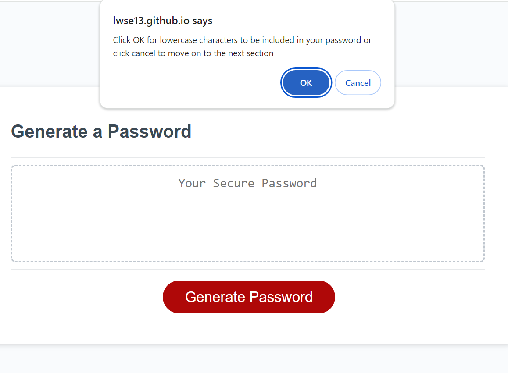
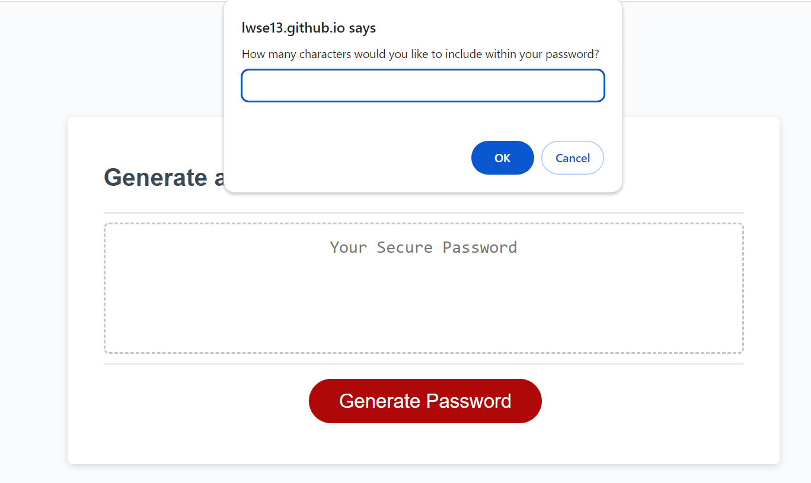

#  Random Password Generator

## Description
A password generator that asks you your password preferences and preferred length before providing you with a random password

I wanted to create this as a way to improve upon my knowledge of javascript arrays and for loops. i also used the math.floor/math.random function for the first time. In the future I would like to add a space to store the recent passwords generated and I would like to add some functions within the generate password function that allows the user to return to a certain point within the generation process if a prompt is failed.

Visit the website here: https://lwse13.github.io/Password-Generator/
 
## Installation
N/A
## Usage
Upon clicking the generate password you will be given a series of prompts asking what characters you would like to include in your password and how long you would like it to be. At least one character type must be selected, otherwise you will be prompted to select at least one. Furthermore when it comes to password length you must enter a number between 8 and 128 otherwise you will be re prompted.

## Credits 
N/A
## License
N/A
